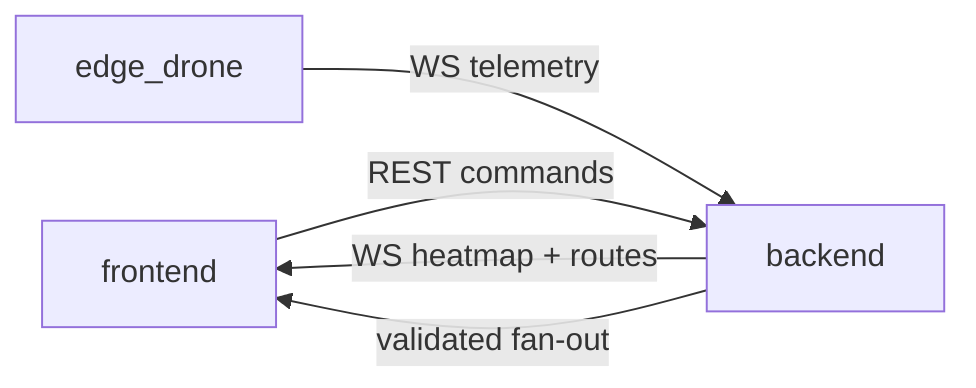

# RescuEdge — Global Agent Instructions

This document defines project scope, cross-cutting coding standards, inter-module contracts, and Git conventions for all AI agents and human contributors working on RescuEdge.

Subsystem-specific rules live in each directory's `AGENT.md`. This file takes precedence for conflicts between subsystems unless a subsystem doc explicitly overrides for local implementation details.

---

## Project Scope

### In Scope

- Monte Carlo particle-filter heatmap with environmental forcing (wind, water current, terrain)
- Bayesian negative search probability updates from drone scan swaths
- Multi-agent path optimization maximizing expected POD
- YOLO-based person detection on edge drone video feeds
- Gimbal-to-ground coordinate projection for detection lock
- Mock telemetry and mock video feed for hackathon demo
- Real-time WebSocket streaming between backend, frontend, and edge_drone
- REST API for mission CRUD and heatmap retrieval

### Out of Scope

- Real FAA Part 107 flight control or autopilot integration
- Production-grade authentication, authorization, or multi-tenancy
- Billing, subscription, or user management
- Persistent mission database (in-memory or Redis acceptable for demo)
- Legal/compliance certification for operational SAR deployment

---

## Repository Conventions

### Branch Naming

```
feat/<subsystem>-<short-desc>    # New feature (e.g., feat/backend-particle-filter)
fix/<issue-or-desc>              # Bug fix (e.g., fix/websocket-reconnect)
docs/<desc>                      # Documentation only
refactor/<desc>                  # Code restructuring, no behavior change
chore/<desc>                     # Tooling, deps, CI
```

`<subsystem>` is one of: `backend`, `frontend`, `edge`, `root`.

### Commit Message Format

Follow [Conventional Commits](https://www.conventionalcommits.org/):

```
type(scope): imperative summary

Optional body explaining why, not what.
```

| Type | Use |
|------|-----|
| `feat` | New capability |
| `fix` | Bug fix |
| `docs` | Documentation |
| `refactor` | Restructure without behavior change |
| `test` | Tests only |
| `chore` | Build, deps, CI |

**Examples:**

```
feat(backend): add systematic resampling to particle filter
fix(frontend): throttle heatmap canvas to 10 fps
docs(edge): document telemetry JSON schema
```

### Pull Requests

- Prefer **one subsystem per PR** when changes are independent
- PR title mirrors commit format: `feat(backend): add negative search endpoint`
- Require passing lint and typecheck before merge
- Include a test plan or manual demo step in the PR description
- Link related issues when applicable

---

## Cross-Cutting Coding Standards

### Python (backend, edge_drone)

- **Python 3.11+** with full type hints on public functions
- Lint with `ruff`; type-check with `mypy` (strict mode where feasible)
- FastAPI handlers must be `async def` when performing I/O
- Use Pydantic v2 models for all API and telemetry schemas
- Prefer pure functions for math (particle filter steps, projection); isolate side effects in service layers
- No bare `except:` — catch specific exceptions

### TypeScript (frontend)

- **Strict mode** enabled in `tsconfig.json`
- Functional React components only — no class components
- Prefer named exports for components and hooks
- Validate WebSocket payloads with Zod or equivalent type guards
- No `any` without an inline justification comment

### Geospatial Conventions

| Context | CRS | Usage |
|---------|-----|-------|
| API payloads | WGS84 (EPSG:4326) | All lat/lon in JSON |
| Distance / physics | UTM zone of LKP | Particle propagation, path lengths |
| Grid indexing | Projected meters from origin | Internal heatmap storage |

- Use `geopandas`, `shapely`, and `pyproj` for transforms — do not hand-roll haversine in hot loops
- GeoJSON coordinates are `[lon, lat]` per RFC 7946

### Time and Identity

- Timestamps: **ISO 8601 UTC** (e.g., `2026-06-02T12:00:00.000Z`)
- IDs: **UUID v4** for missions, assets, particle batches
- Monotonic `frame_id` (integer) for edge drone video frames

---

## Inter-Module Contracts



### Backend Authority

- Backend **owns the probability grid**. It is the single source of truth for heatmap values.
- Frontend **must not** recompute particle physics or negative search updates locally.
- Frontend may apply display transforms (log scale, color mapping) but not alter probability mass.

### Edge Drone Emitter

- Edge drone **emits** telemetry; it does not mutate mission state directly.
- Backend validates all incoming JSON against Pydantic schemas before processing.
- Invalid messages are logged and dropped — never crash the ingest loop.

### Frontend Consumer

- Frontend is **read-mostly** plus command dispatch (create mission, assign assets, trigger optimize).
- All live state arrives via WebSocket; poll REST only for initial load or reconnect recovery.

### Shared Message Types

Message `type` field is the discriminator. Known types:

| Type | Direction | Description |
|------|-----------|-------------|
| `heatmap_delta` | BE → FE | Changed grid cells after filter update |
| `heatmap_full` | BE → FE | Full grid snapshot (on connect) |
| `route_update` | BE → FE | Optimized path for an asset |
| `asset_pose` | BE → FE | Normalized pose from edge telemetry |
| `detection_event` | BE → FE | Target located |
| `pose` | ED → BE | Drone position and attitude |
| `scan_swath` | ED → BE | Searched polygon with POD and result |
| `detection` | ED → BE | YOLO hit with ground coordinates |

Exact schemas for edge → backend messages are defined in [edge_drone/AGENT.md](edge_drone/AGENT.md).

---

## Security and Demo Safety

- **Never commit secrets.** Use `.env.example` with placeholder values only.
- `.env`, `*.pt` model weights, and API keys belong in `.gitignore`.
- Default edge drone to **`--mock` mode** — no real flight hardware required.
- Sanitize all external API responses before feeding into particle filter.
- WebSocket endpoints are unauthenticated for hackathon demo; document this limitation.

---

## Definition of Done

A feature is complete when:

1. Code implements the specified behavior with type hints / strict types
2. Endpoint or message type is documented (OpenAPI or AGENT.md schema)
3. At least one happy-path test **or** documented manual demo step exists
4. Lint and typecheck pass
5. No secrets or debug-only hardcoded coordinates in committed code

---

## File Ownership

| Path | Owner | Notes |
|------|-------|-------|
| `backend/app/services/particle_filter.py` | backend | Core math — see backend/AGENT.md |
| `backend/app/services/negative_search.py` | backend | Bayesian updates |
| `backend/app/services/path_optimizer.py` | backend | Route scoring |
| `frontend/src/components/map/HeatmapCanvas.tsx` | frontend | Canvas rendering |
| `frontend/src/hooks/useWebSocket.ts` | frontend | WS lifecycle |
| `edge_drone/edge_drone/detector.py` | edge | YOLO inference |
| `edge_drone/edge_drone/projection.py` | edge | Gimbal → ground |
| `edge_drone/edge_drone/telemetry.py` | edge | Schema validation + emit |

When working across subsystems, update the relevant `AGENT.md` if contracts change.

---

## Related Documentation

- [README.md](README.md) — Architecture and quick start
- [backend/AGENT.md](backend/AGENT.md) — Particle filter and negative search math
- [frontend/AGENT.md](frontend/AGENT.md) — Heatmap rendering and WebSocket rules
- [edge_drone/AGENT.md](edge_drone/AGENT.md) — CV, projection, telemetry schema
