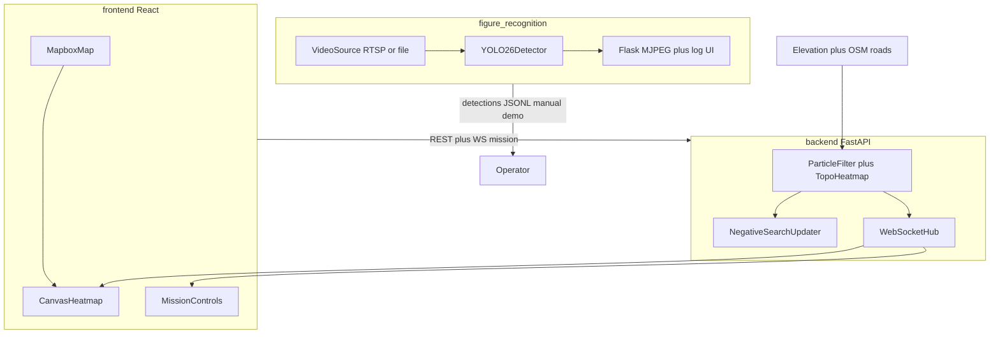

# RescuEdge (CSHACK-2026-LKP)

**Dynamic Search & Rescue (SAR) Intelligence System**

RescuEdge turns a stale Last Known Position (LKP) into live search intelligence by combining environmental physics, probability heatmaps, negative-search updates, and edge drone computer vision.

The active stack is three subsystems:


| Subsystem                                    | Role                                                                                   |
| -------------------------------------------- | -------------------------------------------------------------------------------------- |
| `[backend/](backend/)`                       | FastAPI SAR core — particle filter / topography heatmap, missions, WebSocket streaming |
| `[frontend/](frontend/)`                     | React + Mapbox command center — map, heatmap overlay, mission controls                 |
| `[figure_recognition/](figure_recognition/)` | Drone video pipeline — YOLO26 person detection, live browser UI, JSONL log             |


`topo_layout/` is a standalone prototype (Tobler hiking isochrones). Its heuristic is integrated into the backend **Topography** layer; you do not run `topo_layout` for the demo map — use **frontend + backend**.

---

## Executive Summary

In SAR scenarios, an LKP degrades within minutes. Wind, terrain, and subject mobility displace the search area. Static grids waste time.

RescuEdge provides:

1. **Predictive probability heatmap** — Monte Carlo particle filter with optional topography reachability (Tobler + Dijkstra from LKP). Toggle layers for roads, weather, and injured-subject physics.
2. **Negative search feedback** — Bayesian updates reduce probability in drone-scanned sectors and renormalize the grid.
3. **Live map command center** — Mapbox map with canvas heatmap, LKP/MPP tracking, and WebSocket updates.
4. **Edge drone detection** — `figure_recognition` runs YOLO26 on aerial video (webcam, file, or RTSP), streams annotated MJPEG to the browser, and logs per-second detections.

---

## System Architecture




### Data flow


| Step | Source     | Destination          | Payload                                           |
| ---- | ---------- | -------------------- | ------------------------------------------------- |
| 1    | Operator   | Backend              | Mission: LKP, timestamp, layer flags              |
| 2    | Env APIs   | Backend              | Elevation (Open-Elevation), OSM roads             |
| 3    | Backend    | Frontend             | `heatmap_full`, `engine_tick` (WebSocket)         |
| 4    | Operator   | Backend              | Negative-search polygon + POD                     |
| 5    | Drone feed | `figure_recognition` | YOLO detections, MJPEG stream, `detections.jsonl` |


---

## Prerequisites


| Requirement    | Version | Notes                                 |
| -------------- | ------- | ------------------------------------- |
| Python         | 3.9+    | Backend (`backend/.venv`)             |
| Python + conda | 3.11    | `figure_recognition` (YOLO / PyTorch) |
| Node.js        | 20+     | Frontend build                        |
| Mapbox token   | —       | Frontend map (`VITE_MAPBOX_TOKEN`)    |


---

## Quick Start

Run the map stack and drone pipeline in **separate terminals**. Both default to port **8000** — use backend on `8000` and change `PORT` in `figure_recognition/detect_live.py` (e.g. `8001`) if running both locally.

### Terminal 1 — Backend (port 8000)

```bash
cd backend
python -m venv .venv && source .venv/bin/activate
pip install -r requirements.txt
PYTHONPATH=. uvicorn app.main:app --reload --port 8000
```

API docs: [http://localhost:8000/docs](http://localhost:8000/docs)

### Terminal 2 — Frontend (port 5173)

```bash
cd frontend
npm install
cp .env.example .env   # set VITE_MAPBOX_TOKEN, VITE_BACKEND_URL, VITE_BACKEND_WS_URL
npm run dev
```

Open [http://localhost:5173](http://localhost:5173), click the map to set LKP, start a mission.

### Terminal 3 — Drone detection (`figure_recognition`)

```bash
conda env create -f environment.macos.yaml   # Mac Apple Silicon
# or: conda env create -f environment.yaml     # Linux + CUDA
conda activate cshack
python figure_recognition/detect_live.py
```

Open [http://localhost:8000/](http://localhost:8000/) (or the port you configured). Press `F11` for fullscreen on demo day.

Edit the `CONFIG` block at the top of `figure_recognition/detect_live.py`:

- `SOURCE = 0` — Mac built-in webcam
- `SOURCE = HERE / "samples" / "drone_test.mp4"` — bundled test clip
- RTSP URL — live drone bridge, e.g. `"rtsp://192.168.1.10:8554/live"`

YOLO weights (`yolo26m.pt`) auto-download on first run into `figure_recognition/models/`.

---

## Environment Variables

### Backend (`backend/.env`)


| Variable                  | Description               | Example                 |
| ------------------------- | ------------------------- | ----------------------- |
| `PARTICLE_COUNT`          | Monte Carlo particles     | `5000`                  |
| `GRID_SIZE`               | Heatmap rows/cols         | `128`                   |
| `GRID_RESOLUTION_M`       | Cell size (meters)        | `50`                    |
| `CORS_ORIGINS`            | Allowed frontend origin   | `http://localhost:5173` |
| `TOPO_PROBABILITY_METHOD` | `linear` or `exponential` | `linear`                |


### Frontend (`frontend/.env`)


| Variable              | Description         | Example                          |
| --------------------- | ------------------- | -------------------------------- |
| `VITE_MAPBOX_TOKEN`   | Mapbox public token | `pk.eyJ1...`                     |
| `VITE_BACKEND_URL`    | REST base URL       | `http://localhost:8000`          |
| `VITE_BACKEND_WS_URL` | Mission WebSocket   | `ws://localhost:8000/ws/mission` |


Never commit `.env` files with real tokens.

---

## API Surface (implemented)


| Method | Path                              | Description                          |
| ------ | --------------------------------- | ------------------------------------ |
| `POST` | `/missions`                       | Create mission with LKP and layers   |
| `GET`  | `/missions/{id}`                  | Mission status                       |
| `GET`  | `/heatmap/{mission_id}`           | Current probability grid             |
| `GET`  | `/missions/{id}/heatmap`          | Same grid (mission-scoped)           |
| `POST` | `/negative-search`                | Apply cleared-area Bayesian update   |
| `POST` | `/missions/{id}/pause` / `resume` | Simulation control                   |
| `WS`   | `/ws/mission/{id}`                | Frontend live heatmap + engine ticks |


---

## Demo Script (Judge Walkthrough)

1. **Seed mission** — Open frontend, set LKP on the map, start mission. Backend initializes the probability grid (particle KDE or topography reachability when that layer is on).
2. **Heatmap expansion** — Watch the heatmap update over WebSocket; toggle topography, roads, weather, injured layers.
3. **Negative search** — POST a cleared polygon to `/negative-search`; probability drops inside the sector and redistributes elsewhere.
4. **Drone detection** — Run `figure_recognition/detect_live.py` on sample video or RTSP; show live bbox overlay and `detections.jsonl` log when a person is found.

Estimated duration: **3–5 minutes**.

---

## Repo Layout

```
.
├── README.md
├── AGENT.md                      Global agent / contributor rules
├── environment.yaml              conda env (Linux + CUDA)
├── environment.macos.yaml        conda env (Mac Apple Silicon, MPS)
├── backend/                      FastAPI SAR backend
├── frontend/                     React + Mapbox command center
├── figure_recognition/           YOLO26 drone detection + Flask UI
│   ├── detect_live.py
│   ├── samples/drone_test.mp4
│   ├── models/                   weights (gitignored)
│   └── results/                  detections.jsonl (gitignored)
└── topo_layout/                  standalone prototype (not used for demo map)
```

---

## figure_recognition — Drone Detection

### Conda setup

Mac (Apple Silicon, MPS):

```bash
conda env create -f environment.macos.yaml
conda activate cshack
```

Linux + NVIDIA GPU:

```bash
conda env create -f environment.yaml
conda activate cshack
```

### Optional — OpenMMLab / RTMPose (stretch goal)

```bash
mim install mmengine
mim install "mmcv>=2.0.1"
mim install "mmdet>=3.1.0"
mim install "mmpose>=1.1.0"
```

Download pose weights into `figure_recognition/models/`:

```bash
mkdir -p figure_recognition/models
curl -L -o figure_recognition/models/rtmpose-l_384x288.pth \
  "https://download.openmmlab.com/mmpose/v1/projects/rtmposev1/rtmpose-l_simcc-body7_pt-body7_420e-384x288-3f5a1437_20230504.pth"
curl -L -o figure_recognition/models/rtmdet-m.pth \
  "https://download.openmmlab.com/mmpose/v1/projects/rtmposev1/rtmdet_m_8xb32-100e_coco-obj365-person-235e8209.pth"
```

### Quick test on bundled sample

```bash
conda activate cshack
# In detect_live.py: SOURCE = HERE / "samples" / "drone_test.mp4"
python figure_recognition/detect_live.py
```

The browser shows annotated video (left) and a per-second detection log (right). JSON lines are written to `figure_recognition/results/detections.jsonl`.

---

## Documentation Index


| File                                                         | Purpose                                  |
| ------------------------------------------------------------ | ---------------------------------------- |
| [AGENT.md](AGENT.md)                                         | Global scope, contracts, Git conventions |
| [backend/README.md](backend/README.md)                       | Backend setup and module map             |
| [backend/AGENT.md](backend/AGENT.md)                         | Particle filter, negative search         |
| [frontend/README.md](frontend/README.md)                     | Frontend setup and UI structure          |
| [frontend/AGENT.md](frontend/AGENT.md)                       | Canvas heatmap, WebSocket rules          |
| [figure_recognition/README.md](figure_recognition/README.md) | Detection module layout                  |


---

## License

Hackathon project — internal use during competition. License TBD post-event.