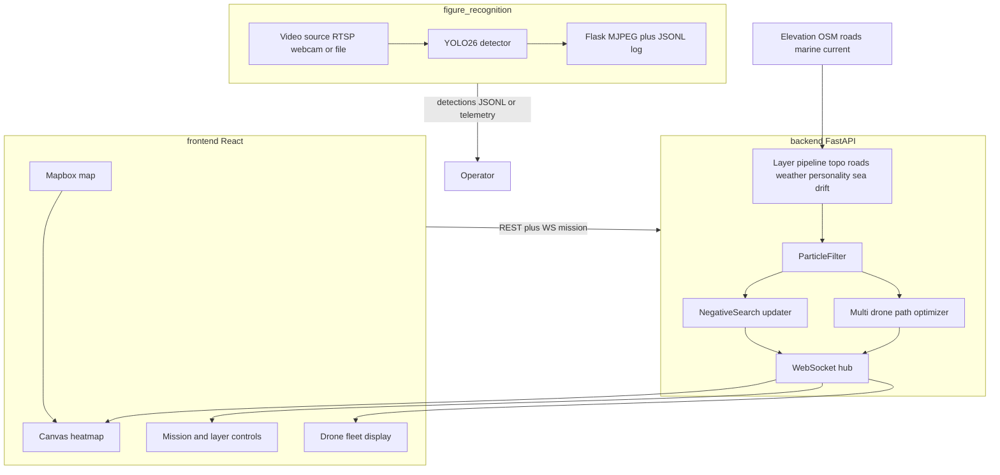

# ADAR (CSHACK-2026-LKP)

**Dynamic Search & Rescue (SAR) Intelligence System**

ADAR turns a stale Last Known Position (LKP) into live, evolving search guidance. It combines environmental physics, probability heatmaps, Bayesian negative-search updates, multi-drone path optimization, and edge drone person detection.

---

## Why

In SAR, an LKP starts decaying the moment it's reported. Wind, terrain, subject mobility, and water currents displace the search area. Static grids waste time and personnel. ADAR replaces them with a probability surface that updates as the world changes — and as the search proceeds.

## What it does

1. **Predictive probability heatmap** — Monte Carlo particle filter seeded at the LKP, advanced through time. Toggle environmental layers (topography, roads, weather, personality, sea drift) to shape the diffusion.
2. **Bayesian negative search** — Sectors cleared by ground teams or drones drop in probability; the rest of the grid renormalizes.
3. **Multi-drone route optimizer** — Plans search routes across a fleet that maximize expected Probability of Detection (POD), respecting per-drone launch delays.
4. **Live map command center** — Mapbox map with a canvas heatmap overlay, mission controls, layer toggles, fleet visualization, all updated over WebSocket.
5. **Edge person detection** — YOLO26 on aerial drone video (webcam, file, or RTSP), with optional MediaMTX server for ingesting DJI RTMP pushes.

---

## Three Subsystems

| Subsystem | Stack | Default port | Responsibility |
|---|---|---|---|
| [`backend/`](backend/) | FastAPI · NumPy · SciPy · GeoPandas · Pydantic v2 | **8000** | Particle filter, layer pipeline, negative search, path optimizer, REST + WebSocket API |
| [`frontend/`](frontend/) | React 18 · Vite · TypeScript · Mapbox GL JS · Zustand | **5173** | Map UI, heatmap renderer, mission/layer controls, fleet display |
| [`figure_recognition/`](figure_recognition/) | Python 3.11 (conda `cshack`) · Ultralytics YOLO26 · OpenCV · Flask | **8000** (use 8001 if backend also running) | Drone video → person detection → JSONL + MJPEG dashboard or annotated MP4 |

`topo_layout/` is an early prototype (Tobler hiking isochrones); its heuristic is now integrated into the backend's topography layer. Don't run it for the demo.

---

## System Architecture



### Data flow

| Step | Source → Destination | Payload |
|---|---|---|
| 1 | Operator → Backend | `POST /missions` — LKP, layer flags, personality, mode (live or offline), drone sortie launch delays |
| 2 | Env APIs → Backend | Open-Elevation tiles, OSM road graph, marine current data |
| 3 | Backend → Frontend | `engine_tick`, `heatmap_full`, `heatmap_delta`, `drone_track`, `detection_flash` (WebSocket) |
| 4 | Operator → Backend | `POST /negative-search` — cleared polygon + POD |
| 5 | Operator → Backend | `POST /missions/{id}/drone-route` — request optimal multi-drone search plan |
| 6 | Drone video → `figure_recognition` | YOLO detections, MJPEG stream, `detections.jsonl` |

---

## Prerequisites

| Requirement | Version | Notes |
|---|---|---|
| Python | 3.9+ | Backend (`backend/.venv`) |
| Python + conda | 3.11 | `figure_recognition` (Ultralytics + PyTorch) |
| Node.js | 20+ | Frontend build |
| Mapbox token | — | Frontend map (set `VITE_MAPBOX_TOKEN` in `frontend/.env`) |

---

## Quick Start (three terminals)

> Backend and `detect_live.py` both default to port 8000. Run backend on 8000 and change `PORT = 8001` at the top of `figure_recognition/detect_live.py` if running both locally.

### Terminal 1 — Backend (port 8000)

```bash
cd backend
python -m venv .venv && source .venv/bin/activate
pip install -r requirements.txt
cp .env.example .env       # tweak particle count, grid size, etc. (optional)
PYTHONPATH=. uvicorn app.main:app --reload --port 8000
```

API docs: <http://localhost:8000/docs>

### Terminal 2 — Frontend (port 5173)

```bash
cd frontend
npm install
cp .env.example .env       # put your VITE_MAPBOX_TOKEN here
npm run dev
```

Open <http://localhost:5173>, click the map to place LKP, then **Run Heatmap**.

### Terminal 3 — Drone detection (`figure_recognition`)

```bash
conda env create -f environment.macos.yaml   # Mac Apple Silicon (MPS)
# or: conda env create -f environment.yaml     # Linux + CUDA
conda activate cshack
python figure_recognition/detect_live.py
```

Open <http://localhost:8000/> (or whichever PORT you set). `F11` for fullscreen.

**Source options** — edit the `CONFIG` block at the top of `detect_live.py`:

- `SOURCE = 0` — Mac webcam
- `SOURCE = HERE / "samples" / "drone_test.mp4"` — bundled sample clip
- `SOURCE = "rtsp://localhost:8554/live/drone"` — RTSP from MediaMTX (see below)

YOLO weights auto-download on first run into `figure_recognition/models/`.

### Optional — Live drone via RTSP

The `server/` directory bundles **MediaMTX** for ingesting a DJI Mini 4 Pro RTMP push and restreaming it as RTSP:

```bash
cd server && ./mediamtx       # opens :1935 (RTMP) and :8554 (RTSP)
```

In DJI Fly: **Profile → Live Stream → Custom RTMP → `rtmp://<your-mac-ip>:1935/live/drone`**. Then point `detect_live.py` at `rtsp://localhost:8554/live/drone`.

---

## Environment Variables

### Backend (`backend/.env`)

| Variable | Description | Default |
|---|---|---|
| `PARTICLE_COUNT` | Monte Carlo particles per mission | `5000` |
| `GRID_SIZE` | Heatmap grid rows/cols | `128` |
| `GRID_RESOLUTION_M` | Cell size, meters | `25` |
| `FILTER_HZ` | Particle filter tick frequency | `1` |
| `CORS_ORIGINS` | Comma-separated allowed frontend origins | `http://localhost:5173,http://127.0.0.1:5173` |
| `ROADS_DATA_SOURCE` | Where to fetch OSM roads (`auto`, `local`, `osm`) | `auto` |
| `TERRAIN_INSPECT_RESOLUTION_M` | Resolution for terrain inspection endpoint | `25` |

### Frontend (`frontend/.env`)

| Variable | Description | Example |
|---|---|---|
| `VITE_MAPBOX_TOKEN` | Mapbox public token | `pk.eyJ1...` |
| `VITE_BACKEND_URL` | REST base URL | `http://localhost:8000` |
| `VITE_BACKEND_WS_URL` | Mission WebSocket base | `ws://localhost:8000/ws/mission` |

`.env` files are gitignored. Use the bundled `.env.example` as your template. Never commit a real Mapbox token.

---

## API Surface

| Method | Path | Description |
|---|---|---|
| `POST` | `/missions` | Create mission (LKP, layers, mode, sortie delays, personality) |
| `GET` | `/missions/{id}` | Mission status |
| `DELETE` | `/missions/{id}` | Tear down mission |
| `POST` | `/missions/{id}/pause` · `resume` | Simulation control |
| `PATCH` | `/missions/{id}/pace` | Change simulated-time pace |
| `GET` | `/missions/{id}/heatmap` | Current probability grid |
| `GET` | `/missions/{id}/node-fields` | Per-cell terrain data |
| `POST` | `/missions/{id}/drone-route` | Run multi-drone path optimizer |
| `POST` | `/negative-search` | Apply cleared-area Bayesian update |
| `GET` | `/terrain/inspect` | Inspect terrain at a coordinate |
| `WS` | `/ws/mission/{id}` | Live engine ticks, heatmap deltas, drone tracks, detection flashes |

---

## Demo Script (Judge Walkthrough)

**3-5 minutes, two terminals (backend + frontend) plus optional drone CV.**

1. **Seed mission** — Frontend → click map to place LKP → **Pin LKP** → adjust pace/layers/sortie delays → **Run Heatmap**. Backend builds the initial probability grid.
2. **Layer toggles** — Flip topography, roads, weather, sea-drift; show how the heatmap shape changes (steep terrain channels probability into valleys; roads bias toward roadways; sea drift pushes mass downstream).
3. **Time evolution** — Resume / pause; pace slider speeds up simulated time. The heatmap diffuses outward from the LKP.
4. **Plan search** — Click **Find Drone Route** → optimizer returns multi-drone routes with total expected coverage %; routes overlay on the map.
5. **Negative search** — Draw a cleared polygon, POST to `/negative-search`; probability inside drops, the rest renormalizes (visible on the heatmap).
6. **Edge detection demo** (separate terminal) — `python figure_recognition/detect_live.py` on bundled aerial footage → live bounding boxes in the browser + `detections.jsonl` log.

---

## Repo Layout

```
.
├── README.md
├── AGENT.md                       Global contributor / agent rules
├── environment.yaml               conda env (Linux + CUDA)
├── environment.macos.yaml         conda env (Mac Apple Silicon, MPS)
├── backend/                       FastAPI SAR core
│   ├── app/
│   │   ├── api/                   REST + WebSocket routes
│   │   ├── core/                  Settings, logging
│   │   ├── layers/                topography, roads, weather, personality, sea drift
│   │   ├── models/                Pydantic schemas
│   │   └── services/              particle_filter, negative_search, path_optimizer, drone_detection, marine_current, ...
│   ├── tests/
│   ├── requirements.txt
│   └── .env.example
├── frontend/                      React + Mapbox command center
│   ├── src/components/            map, panels, ui
│   ├── src/stores/                Zustand mission store
│   ├── src/hooks/                 useWebSocket, useHeatmap, useMission
│   ├── package.json
│   └── .env.example
├── figure_recognition/            Drone CV
│   ├── detect_live.py             RTSP/webcam/file → Flask MJPEG dashboard + JSONL
│   ├── detect_offline.py          Video file → JSONL + annotated MP4 (CLI)
│   ├── prepare_drone_data.py      Merge CSV telemetry with detection JSON
│   ├── merge_gps.py               Join detection timestamps with GPS
│   ├── samples/                   Test clips (bundled)
│   ├── models/                    YOLO weights (gitignored)
│   └── results/                   JSONL output (gitignored)
├── server/                        MediaMTX RTMP/RTSP relay (binary gitignored)
├── scripts/                       slurm setup, deploy helpers
└── topo_layout/                   prototype only (not run for demo)
```

---

## Documentation Index

| File | Purpose |
|---|---|
| [AGENT.md](AGENT.md) | Project scope, cross-cutting standards, Git conventions |
| [backend/README.md](backend/README.md) | Backend setup, module map, particle filter notes |
| [backend/AGENT.md](backend/AGENT.md) | Backend-specific contracts |
| [backend/LAYERS.md](backend/LAYERS.md) | Layer pipeline reference |
| [backend/INTERACTIVE_LAYERS.md](backend/INTERACTIVE_LAYERS.md) | Layer interaction semantics |
| [frontend/README.md](frontend/README.md) | Frontend setup, UI structure |
| [frontend/AGENT.md](frontend/AGENT.md) | Canvas heatmap and WebSocket rules |
| [figure_recognition/README.md](figure_recognition/README.md) | Detection module layout |

---

## License

Hackathon project — internal use during CSHACK 2026. License TBD post-event.
