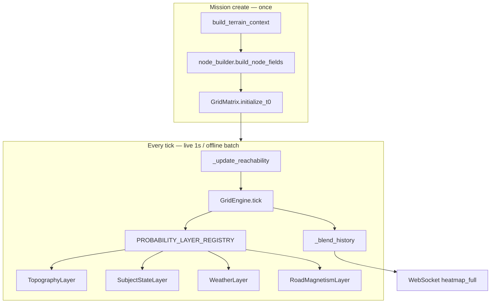

# Layer Design & Implementation Guide

This is the **authoritative contract** for the Grid Matrix heatmap engine and its probability layers. Use it when adding, updating, or tuning a layer. Follow it for parallel team work without merge conflicts.

Global conventions: [AGENT.md](AGENT.md) · Frontend UI: [../frontend/AGENT.md](../frontend/AGENT.md)

---

## Design principles

1. **Grid Matrix is the source of truth** — state lives on an `A×A` probability matrix, not particles.
2. **One layer = one file** — layer physics lives only in `app/engine/layers/<name>.py`.
3. **One method per layer** — `transition_weights()` is the only hook layers implement.
4. **Registry is the only cross-layer import hub** — `app/engine/layers/registry.py` is the sole file that imports all layers.
5. **Do not special-case layers in the engine** — no `if layer_id == "roads"` in `grid_engine.py` or `mission_store.py`.
6. **At least one layer always on** — if all toggles are off, `topography` is forced on (backend + frontend).

Legacy code under `app/layers/` (particle pipeline) is **deprecated** and not used by the live tick loop.

---

## Architecture



| Component | Path | Team touches? |
|-----------|------|---------------|
| Grid matrix & t=0 init | `app/engine/grid_matrix.py` | Engine owners only |
| Core tick loop | `app/engine/grid_engine.py` | Engine owners only |
| Layer interface | `app/engine/layers/base.py` | Engine owners only |
| **Your layer** | `app/engine/layers/<your_layer>.py` | **Your team** |
| Registry (one line) | `app/engine/layers/registry.py` | **Your team** (one import + list entry) |
| Node field population | `app/engine/node_builder.py` | If you need new per-cell data |
| Mission orchestration | `app/services/mission_store.py` | Engine owners only |
| Reachability (topography) | `app/services/topo_reachability.py` | Topography team |
| Layer toggles API | `app/models/layers.py` | **Your team** (one `LayerFlags` field) |
| Config knobs | `app/core/config.py` + `.env.example` | **Your team** (optional) |

---

## Spatial grid (the matrix)

| Symbol | Config | Default | Meaning |
|--------|--------|---------|---------|
| **A** | `GRID_SIZE` | 128 | Matrix width/height (cells) |
| **Y** | `GRID_RESOLUTION_M` | 50 | Meters per cell edge |
| **LKP cell** | — | `[A/2, A/2]` | Center cell holds probability 1.0 at t=0 |

Total search area: **(A × Y) × (A × Y)** meters, centered on the LKP.

### t = 0 initialization

```python
probabilities.fill(0.0)
probabilities[lkp_row, lkp_col] = 1.0
```

---

## Update rules (when the heatmap changes)

Two separate clocks:

| Clock | Source | Default | Effect |
|-------|--------|---------|--------|
| **Wall-clock refresh** | `LIVE_UPDATE_INTERVAL_SEC` in `app/models/mission.py` | **1 s** | How often live mode pushes `heatmap_full` over WebSocket |
| **Simulated time per tick** | `step_sec = BASE_STEP_SEC × pace` | **10 s × pace** | How much time layers see as `ctx.dt_sec`; reachability horizon grows by this each tick |

Pace comes from the UI / `POST /missions` / `PATCH /missions/{id}/pace` — **not** from `.env`.

### What runs each tick

```
1. _update_reachability()     ← topography: refresh Dijkstra horizon
2. GridEngine.tick()          ← all active layers → transition_weights()
3. _finalize_probabilities()  ← topography: multiply by reachability prior
4. _blend_history()           ← heatmap_history_decay (default 0.86)
5. broadcast heatmap_full + engine_tick
```

### When a layer toggle takes effect

| Action | Result |
|--------|--------|
| User toggles checkbox (WS open) | `{ event: "update_layers", layers: {...} }` → backend updates `LayerFlags` → **immediate extra tick** |
| User sets layers before mission | Applied on `POST /missions` create |
| Pause | Tick loop sleeps but skips simulation while `simulation_running == false` |

---

## Node data (`NodeFields`)

Each cell stores inputs layers read via `ctx.node_fields`:

| Field | Populated by | Used by |
|-------|--------------|---------|
| `elevation`, `slope`, `is_land` | `env_ingestion` | Topography |
| `road_proximity`, `road_tangent_e/n`, `is_road` | `env_ingestion` | Roads |
| `wind_u`, `wind_v` | `node_builder` (from env) | Weather |
| `reachability` | `mission_store._update_reachability` each tick | Topography |

### Adding a new per-cell field

1. Add field to `NodeFields` in `app/engine/grid_matrix.py`
2. Populate it in `app/engine/node_builder.py` (and/or refresh in `mission_store` if time-varying)
3. Read it in your layer's `transition_weights()`
4. Document it in this file under **Layer catalog**

---

## Layer plugin contract

### Interface (`app/engine/layers/base.py`)

```python
class BaseProbabilityLayer(ABC):
    layer_id: str              # must match LayerFlags field name
    default_enabled: bool
    default_weight: float      # 0–1 blend strength when enabled

    def transition_weights(
        self,
        ctx: TransitionContext,
        row: int,
        col: int,
        weight: float,
    ) -> np.ndarray:
        """Length-9 vector, index 4 = self. Additive adjustments to baseline."""
```

### Neighbor indexing (`app/engine/neighbors.py`)

Index | Offset (drow, dcol) | Compass
------|---------------------|--------
0 | (-1, -1) | NW
1 | (-1, 0) | N
2 | (-1, 1) | NE
3 | (0, -1) | W
4 | (0, 0) | **self**
5 | (0, 1) | E
6 | (1, -1) | SW
7 | (1, 0) | S
8 | (1, 1) | SE

Grid convention: **row increases south**, **col increases east**.

### Weight semantics

- UI sends **enabled/disabled** only.
- `default_weight` on the layer class scales physics (tuned in code or `config.py`, not UI v1).
- Return **additive** adjustments; `GridEngine` adds them to baseline isotropic outflow and **normalizes** to sum 1.
- Negative adjustments suppress flow; large negatives (~`-10`) effectively block a neighbor.

### Baseline diffusion (engine-owned)

Every tick, before layers run, each cell keeps `(1 - GRID_BASE_OUTFLOW)` on self and leaks `GRID_BASE_OUTFLOW` evenly to valid neighbors. Default `GRID_BASE_OUTFLOW = 0.22`.

---

## Checklist: add a new layer

Copy this checklist into your PR description.

### Backend (required)

- [ ] **1. Create layer file** — `backend/app/engine/layers/my_layer.py`
  - Extend `BaseProbabilityLayer`
  - Set `layer_id`, `default_enabled`, `default_weight`
  - Implement `transition_weights()`
- [ ] **2. Register** — `backend/app/engine/layers/registry.py`
  - Import your class
  - Append to `PROBABILITY_LAYER_REGISTRY`
- [ ] **3. LayerFlags** — `backend/app/models/layers.py`
  - Add boolean field matching `layer_id` exactly
  - Update `apply_update()`, `as_dict()`, `any_enabled()`
- [ ] **4. Tests** — `backend/tests/test_grid_engine.py` (or `tests/test_layers/test_my_layer.py`)
  - Mass conservation with only your layer + baseline
  - At least one assertion on directional bias or blocking behavior

### Backend (if needed)

- [ ] **5. NodeFields** — `grid_matrix.py` + `node_builder.py` if new per-cell data
- [ ] **6. Config** — `app/core/config.py` default + `backend/.env.example` entry
- [ ] **7. Terrain ingestion** — `app/services/env_ingestion.py` if fetching external data at create

### Frontend (required for UI toggle)

- [ ] **8. Store type** — `frontend/src/stores/missionStore.ts`
  - Add key to `LayerState` interface and `DEFAULT_LAYERS`
- [ ] **9. Layer panel** — `frontend/src/components/panels/LayerControls.tsx`
  - Add entry to `LAYER_CONFIG` (label + hint)
- [ ] **10. WS schema** — `frontend/src/types/ws-messages.ts`
  - Add boolean to `layerStateSchema`

### Docs

- [ ] **11. Catalog** — add section under **Layer catalog** below in this file
- [ ] **12. Run tests** — `cd backend && python -m pytest -q`

### Do NOT edit (unless you are the engine owner)

- `app/engine/grid_engine.py`
- `app/services/mission_store.py`
- Other layers' files
- `app/layers/` (legacy particle code)

---

## Checklist: update an existing layer

| Change | Files to edit |
|--------|---------------|
| **Physics / transition math only** | `app/engine/layers/<layer>.py`, tests, config if new knobs |
| **Default on/off** | `default_enabled` in layer class |
| **Blend strength** | `default_weight` in layer class |
| **Rename UI label** | `frontend/.../LayerControls.tsx` only |
| **New config knob** | `config.py`, `.env.example`, layer file |
| **Reachability / Tobler model** | `topo_reachability.py` + `TopographyLayer` + `mission_store._update_reachability` (topography owners) |

After any backend layer change, toggle the layer in the UI or run `pytest` — WS triggers an immediate tick on toggle.

---

## Reference implementation: `RoadMagnetismLayer`

File: `app/engine/layers/road_magnetism.py`

```python
class RoadMagnetismLayer(BaseProbabilityLayer):
    layer_id = "roads"
    default_enabled = False
    default_weight = 1.0

    def transition_weights(self, ctx, row, col, weight) -> np.ndarray:
        adjustments = np.zeros(9)
        prox = ctx.node_fields.road_proximity[row, col]
        if prox < threshold:
            return adjustments  # no effect off-road

        te = ctx.node_fields.road_tangent_e[row, col]
        tn = ctx.node_fields.road_tangent_n[row, col]
        strength = settings.road_snap_strength * prox * weight

        for i, (dr, dc) in enumerate(NEIGHBOR_OFFSETS):
            if dr == 0 and dc == 0:
                continue
            neighbor_n, neighbor_e = -dr, dc
            alignment = tn * neighbor_n + te * neighbor_e
            if alignment > 0:
                adjustments[i] += strength * alignment

        return adjustments  # engine merges + normalizes
```

**Behavior:** probability bleeds preferentially along OSM road tangents when `road_proximity` is high.

---

## Layer catalog

### Topography (`topography`) — default **on**, weight **0.65**

| Aspect | Detail |
|--------|--------|
| File | `app/engine/layers/topography.py` |
| Transition | Block flow to water; bias toward high `reachability`; penalize uphill steps |
| Post-tick | `apply_reachability_to_grid()` in `mission_store._finalize_probabilities` |
| Reachability | `app/services/topo_reachability.py` — Tobler + Dijkstra from LKP |
| Config | `tobler_flat_speed_kmh` (default **4.7**), `topo_steep_weight`, `topo_steep_threshold_deg`, `terrain_beta` |

### Road magnetism (`roads`) — default **off**

| Aspect | Detail |
|--------|--------|
| File | `app/engine/layers/road_magnetism.py` |
| Transition | Boost outflow to neighbors aligned with `road_tangent` |
| Node data | `road_proximity`, `road_tangent_e`, `road_tangent_n` |
| Config | `diffusion_steps`, `momentum_reference_dt_sec`, `road_kde_bonus`, `road_l2_weight`, `road_topology_weight` |

### Subject state (`subject_injured`) — default **off**

| Aspect | Detail |
|--------|--------|
| File | `app/engine/layers/subject_state.py` |
| Transition | Retain mass on self; suppress neighbor outflow (injured / sheltering) |
| Config | `injured_velocity_factor` |

### Weather (`weather`) — default **off**

| Aspect | Detail |
|--------|--------|
| File | `app/engine/layers/weather.py` |
| Transition | Bias outflow downwind using `ctx.env` (mock 4 m/s N, 2.5 m/s E when on) |
| Node data | `wind_u`, `wind_v` (filled in `node_builder`) |
| Config | `momentum_reference_dt_sec` (default **60 s**) — scales advection/diffusion step count by `dt_sec / 60`; independent of `BASE_STEP_SEC` (10 s sim clock) |

---

## Runtime registration (optional)

For experiments without editing the registry file:

```python
from app.engine.layers.registry import register_layer
register_layer(MyCustomLayer())
```

Production layers should always be listed in `PROBABILITY_LAYER_REGISTRY`.

---

## Configuration reference

Set in `backend/.env` (see `.env.example`) or defaults in `app/core/config.py`:

| Variable | Default | Layer / engine |
|----------|---------|----------------|
| `GRID_SIZE` | 128 | Matrix A |
| `GRID_RESOLUTION_M` | 50 | Cell size Y (m) |
| `GRID_BASE_OUTFLOW` | 0.22 | Baseline spread per tick |
| `HEATMAP_HISTORY_DECAY` | 0.86 | Tick-to-tick memory; lower = tighter cloud |
| `TOBLER_FLAT_SPEED_KMH` | 4.7 | Topography walking speed on flat ground |
| `MOMENTUM_REFERENCE_DT_SEC` | 60 | Reference tick length for road/weather diffusion scaling (not the sim clock) |
| `ROAD_SNAP_STRENGTH` | 0.85 | Roads |
| `INJURED_VELOCITY_FACTOR` | 0.25 | Subject injured |
| `TERRAIN_BETA` | 0.15 | Topography reachability bias |

Hardcoded (not `.env`): `BASE_STEP_SEC = 10` in `app/models/mission.py`; live refresh interval from `filter_hz` (default 1 Hz).

---

## Validation rules

- Unknown layer keys in API/WS payloads are **ignored**.
- All layers off → **`topography` forced on** (`ensure_min_one_layer` / frontend `setLayers`).
- Offline mode requires `lkp_timestamp` and `simulation_start_timestamp`; batch-computes ticks to start time, then runs the live tick loop with pace control.

---

## Related docs

- [AGENT.md](AGENT.md) — API routes, deployment, particle legacy math
- [../frontend/AGENT.md](../frontend/AGENT.md) — WebSocket messages, map overlay
