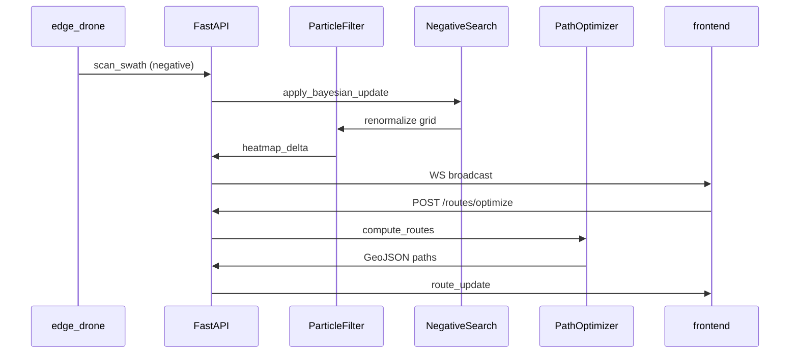

# RescuEdge Backend

FastAPI service providing the SAR intelligence core: particle-filter simulation, Bayesian negative search updates, geospatial grid operations, and multi-agent path optimization.

---

## Tech Stack

| Package | Purpose |
|---------|---------|
| **FastAPI** | Async REST + WebSocket API |
| **Uvicorn** | ASGI server |
| **NumPy** | Particle arrays, grid math |
| **SciPy** | KDE, spatial utilities, optimization helpers |
| **GeoPandas** | Geospatial DataFrames, CRS transforms |
| **Shapely** | Polygon operations, point-in-polygon |
| **PyProj** | WGS84 ↔ UTM projection |
| **Pydantic v2** | Request/response and telemetry schemas |
| **WebSockets** | Real-time mission streaming |
| **Redis** (optional) | Pub/sub cache for multi-worker fan-out |

---

## Directory Structure

```
backend/
├── app/
│   ├── main.py                 # FastAPI app factory, lifespan, CORS
│   ├── api/
│   │   ├── routes/
│   │   │   ├── missions.py     # POST/GET /missions
│   │   │   ├── heatmap.py      # GET /heatmap/{mission_id}
│   │   │   ├── routes.py       # POST /routes/optimize
│   │   │   └── negative_search.py
│   │   └── ws/
│   │       ├── telemetry.py    # WS /ws/telemetry (edge ingest)
│   │       └── mission.py      # WS /ws/mission/{id} (frontend stream)
│   ├── core/
│   │   ├── config.py           # Settings from env
│   │   └── logging.py
│   ├── models/
│   │   ├── mission.py
│   │   ├── heatmap.py
│   │   ├── telemetry.py        # Edge → backend schemas
│   │   └── routes.py
│   ├── services/
│   │   ├── particle_filter.py  # Predict, resample, KDE → grid
│   │   ├── negative_search.py  # Bayesian scan updates
│   │   ├── path_optimizer.py   # Multi-agent POD routing
│   │   └── env_ingestion.py    # Wind/current/elevation fetch
│   └── geospatial/
│       ├── crs.py              # WGS84 ↔ UTM helpers
│       └── grid.py             # Grid indexing, bbox, cell polygons
├── tests/
│   ├── test_particle_filter.py
│   ├── test_negative_search.py
│   └── test_path_optimizer.py
├── requirements.txt
├── pyproject.toml
└── .env.example
```

---

## Setup

### 1. Create Virtual Environment

```bash
cd backend
python -m venv .venv
source .venv/bin/activate        # Windows: .venv\Scripts\activate
```

### 2. Install Dependencies

```bash
pip install -r requirements.txt
# Or editable install with dev extras:
pip install -e ".[dev]"
```

### 3. Configure Environment

```bash
cp .env.example .env
```

| Variable | Default | Description |
|----------|---------|-------------|
| `PARTICLE_COUNT` | `10000` | Monte Carlo particles per mission |
| `GRID_RESOLUTION_M` | `50` | Heatmap cell size (meters) |
| `GRID_SIZE` | `256` | Grid dimension (cells per side) |
| `FILTER_HZ` | `1` | Particle propagation rate |
| `ENV_DATA_API_KEY` | — | External weather/current API key |
| `REDIS_URL` | — | Optional Redis for pub/sub |
| `CORS_ORIGINS` | `http://localhost:5173` | Frontend origin |

### 4. Run Development Server

```bash
uvicorn app.main:app --reload --host 0.0.0.0 --port 8000
```

OpenAPI docs: `http://localhost:8000/docs`

### 5. Run Tests

```bash
pytest -q
pytest -q --cov=app tests/
```

---

## Key Endpoints

### REST

| Method | Path | Request | Response |
|--------|------|---------|----------|
| `POST` | `/missions` | `{ lkp: {lat, lon}, timestamp, subject_type, bbox? }` | `{ mission_id, status }` |
| `GET` | `/missions/{id}` | — | Full mission state |
| `GET` | `/heatmap/{mission_id}` | `?format=geojson\|binary` | Probability grid |
| `POST` | `/missions/{id}/drone-route` | — | `{ mission_id, route: { type: "LineString", coordinates: [[lon, lat], ...] }, expected_coverage, length_m, route_points }` |
| `POST` | `/negative-search` | `{ mission_id, polygon, pod, result }` | Updated grid summary |
| `POST` | `/routes/optimize` | `{ mission_id, assets: [{id, type, endurance_m}] }` | `{ routes: [{ asset_id, geojson }] }` |

### WebSocket

| Path | Client | Direction |
|------|--------|-----------|
| `/ws/telemetry` | edge_drone | Ingest `pose`, `scan_swath`, `detection` |
| `/ws/mission/{id}` | frontend | Push `heatmap_delta`, `route_update`, `detection_event` |

`detection_event` is emitted from the real figure-recognition JSONL feed during
mission ticks. It contains `person_found`, `confidence`, `confidence_percent`,
`timestamp`, optional `frame` and `bbox`, and optional WGS84 `position`.

---

## Service Architecture



---

## Performance Targets

| Metric | Target | Notes |
|--------|--------|-------|
| Particle count | 10,000 | At 1 Hz on laptop CPU |
| Grid size | 256 × 256 max | ~65k cells |
| Filter step latency | < 100 ms | Predict + KDE |
| Negative search update | < 50 ms | Polygon mask + renormalize |
| WS broadcast latency | < 50 ms | After state mutation |

Use NumPy vectorization for all particle operations. Avoid Python loops over individual particles.

---

## Development Guidelines

- Read [AGENT.md](AGENT.md) before implementing filter math or negative search logic.
- All geospatial operations go through `geopandas`/`shapely` — see root [AGENT.md](../AGENT.md).
- Pure functions for filter steps; side effects only in service layer and WebSocket handlers.
- Emit `heatmap_delta` (sparse changed cells) over WebSocket, not full grid, when possible.

---

## Related Documentation

- [../README.md](../README.md) — System overview and quick start
- [../AGENT.md](../AGENT.md) — Global conventions
- [AGENT.md](AGENT.md) — Particle filter formulas, negative search math, path optimizer rules
