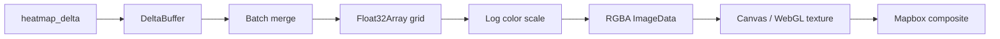

# RescuEdge Frontend — Agent Instructions

AI agents implementing frontend components **must** follow these rules. They supplement global conventions in [../AGENT.md](../AGENT.md).

---

## React Hooks Policy

### Mandatory

- **Functional components only.** No class components, no `PureComponent`, no `Component`.
- **Hooks for all state and effects:** `useState`, `useReducer`, `useEffect`, `useCallback`, `useMemo`, `useRef`, custom hooks.
- Extract reusable logic into custom hooks under `src/hooks/`.
- One state store (Zustand) for mission-wide state — do not introduce Redux, MobX, or additional global stores without justification.

### Forbidden

```typescript
// FORBIDDEN — class component
class HeatmapLayer extends React.Component { ... }

// FORBIDDEN — direct DOM manipulation outside canvas/map ref
document.getElementById('heatmap').innerHTML = ...;

// FORBIDDEN — recomputing probability on client
const updatedGrid = applyNegativeSearch(grid, polygon); // backend owns this
```

### Required Patterns

```typescript
// Custom hook for WebSocket
export function useWebSocket(url: string, handlers: MessageHandlers) {
  const wsRef = useRef<WebSocket | null>(null);
  // ...
}

// Memoized canvas paint callback
const paintHeatmap = useCallback((grid: Float32Array) => {
  // ImageData manipulation
}, [colorScale]);
```

---

## Heatmap Rendering — Canvas Only

Probability grids with up to 256×256 cells (65,536 values) updating at 1–10 Hz **must not** use DOM elements (divs, SVG rects) per cell.

### Architecture

Use one of two approved approaches:

1. **Mapbox Custom Layer (preferred)** — Implement `CustomLayerInterface` with WebGL or 2D canvas texture upload.
2. **Absolute-positioned canvas overlay** — Sync position/size on map `move`/`zoom`; draw with `CanvasRenderingContext2D`.

### Render Pipeline



### Implementation Rules

| Rule | Detail |
|------|--------|
| Offscreen buffer | Maintain `Float32Array` grid in memory; mutate on delta |
| Paint trigger | `requestAnimationFrame` — coalesce multiple WS messages per frame |
| Throttle | Max **10 fps** during burst updates; drop intermediate frames |
| Color scale | Logarithmic: `t = log(P + ε) / log(P_max + ε)` where ε = 1e-8 |
| Color ramp | Transparent (P ≈ 0) → `#2166AC` (blue) → `#FDE725` (yellow) → `#B2182B` (red) |
| Alpha channel | `alpha = 0` where P < 1e-6; max alpha 0.7 at high P |
| No particles | Never render individual particle markers (10k DOM nodes) |

### Color Scale Reference

```typescript
// src/utils/colorScale.ts
export function probabilityToRGBA(p: number, pMax: number): [number, number, number, number] {
  if (p < 1e-6) return [0, 0, 0, 0];
  const t = Math.log(p + 1e-8) / Math.log(pMax + 1e-8);
  // Interpolate blue → yellow → red via piecewise linear RGB
  const alpha = Math.min(0.7, t * 0.7 + 0.1);
  return [r, g, b, Math.round(alpha * 255)];
}
```

### Canvas Paint Sketch

```typescript
function paintGrid(ctx: CanvasRenderingContext2D, grid: Float32Array, rows: number, cols: number) {
  const imageData = ctx.createImageData(cols, rows);
  const pMax = Math.max(...grid, 1e-8);
  for (let i = 0; i < grid.length; i++) {
    const [r, g, b, a] = probabilityToRGBA(grid[i], pMax);
    const offset = i * 4;
    imageData.data[offset] = r;
    imageData.data[offset + 1] = g;
    imageData.data[offset + 2] = b;
    imageData.data[offset + 3] = a;
  }
  ctx.putImageData(imageData, 0, 0);
}
```

Use `Float32Array` max via loop, not spread, for large grids.

---

## WebSocket Handling

### Hook Contract

```typescript
interface UseWebSocketOptions {
  onMessage: (msg: WsMessage) => void;
  onConnect?: () => void;
  onDisconnect?: () => void;
  reconnect?: boolean;           // default: true
  maxReconnectDelayMs?: number; // default: 30000
}

function useWebSocket(url: string | null, options: UseWebSocketOptions): {
  status: 'connecting' | 'open' | 'closed' | 'error';
  send: (data: string) => void;
};
```

### Reconnection

- Exponential backoff: `delay = min(1000 * 2^attempt, maxReconnectDelayMs)`
- Reset attempt counter on successful open
- On reconnect, request `heatmap_full` snapshot from backend (or re-fetch via REST)

### Message Parsing

```typescript
const wsMessageSchema = z.discriminatedUnion('type', [
  heatmapFullSchema,
  heatmapDeltaSchema,
  routeUpdateSchema,
  assetPoseSchema,
  detectionEventSchema,
]);

function handleRawMessage(raw: string) {
  const parsed = JSON.parse(raw);
  const result = wsMessageSchema.safeParse(parsed);
  if (!result.success) {
    if (import.meta.env.DEV) console.warn('Unknown WS message:', result.error);
    return;
  }
  dispatchMessage(result.data);
}
```

- Ignore unknown message types in production (silent)
- Warn in development only

### Delta Batching

Buffer incoming `heatmap_delta` messages for 16 ms (one frame), then merge:

```typescript
function mergeDeltas(deltas: HeatmapDelta[]): Map<string, number> {
  const merged = new Map<string, number>();
  for (const delta of deltas) {
    for (const cell of delta.cells) {
      merged.set(`${cell.row},${cell.col}`, cell.probability);
    }
  }
  return merged;
}
```

Apply merged delta to grid once per animation frame.

---

## Map Integration Rules

### Heatmap Bounds Sync

- Store grid metadata from `heatmap_full`: `{ origin, resolution_m, rows, cols, crs_epsg }`
- Compute geographic bounds of grid corners
- On map `move`/`zoom`, update canvas CSS transform or custom layer projection matrix
- Heatmap must stay georeferenced — no screen-space drift

### Asset Markers

- **Single GeoJSON source** named `assets`
- Update with `source.setData(featureCollection)` — never `new mapboxgl.Marker()` per asset
- Icon: distinct symbols for `drone` vs `ground` asset types

### Route Lines

- GeoJSON source `routes` with one feature per asset
- Style: dashed line for planned route, solid for active traversal
- Color by asset ID from a fixed palette

### Detection Pin

- On `detection_event`, add a `Feature` with `Point` geometry
- Pulse animation via Mapbox `circle-radius` transition or CSS on HTML marker (single pin only — acceptable DOM exception)

---

## Performance Budget

| Metric | Target |
|--------|--------|
| Initial load (dev) | < 3 s to interactive map |
| WS message → store update | < 16 ms |
| Store update → canvas paint | < 50 ms |
| End-to-end WS → visible heatmap | < 200 ms |
| Memory (grid) | ~256 KB for 256×256 Float32Array |
| React re-renders on delta | Only `HeatmapCanvas` + affected panels |

### Optimization Checklist

- [ ] `React.memo` on map child components that don't depend on grid state
- [ ] `useCallback` for event handlers passed to Mapbox
- [ ] Grid mutations via ref or Zustand ` immer` — avoid copying full grid on every delta
- [ ] Debounce map resize handler (100 ms)

---

## Accessibility

- All interactive controls: keyboard focusable with visible focus ring
- `aria-label` on icon-only buttons (e.g., "Optimize routes", "Create mission")
- Heatmap legend includes numeric probability range, not color alone
- Mission status communicated via text badge (`Searching`, `Target Located`), not color only
- Timeline events readable by screen readers (`role="log"`, `aria-live="polite"`)

---

## TypeScript Schemas

Define in `src/types/ws-messages.ts`:

```typescript
export interface HeatmapFull {
  type: 'heatmap_full';
  mission_id: string;
  timestamp: string;
  metadata: GridMetadata;
  probabilities: number[]; // row-major, length = rows * cols
}

export interface HeatmapDelta {
  type: 'heatmap_delta';
  mission_id: string;
  timestamp: string;
  cells: Array<{ row: number; col: number; probability: number }>;
}

export interface RouteUpdate {
  type: 'route_update';
  mission_id: string;
  asset_id: string;
  route: GeoJSON.LineString;
  expected_pod: number;
  length_m: number;
}

export interface AssetPose {
  type: 'asset_pose';
  mission_id: string;
  asset_id: string;
  timestamp: string;
  position: { lat: number; lon: number; alt_m: number };
  attitude: { roll_deg: number; pitch_deg: number; yaw_deg: number };
  ground_speed_mps: number;
  battery_pct: number;
}

export interface DetectionEvent {
  type: 'detection_event';
  mission_id: string;
  asset_id: string;
  timestamp: string;
  target: { lat: number; lon: number; confidence: number };
}

export type WsMessage = HeatmapFull | HeatmapDelta | RouteUpdate | AssetPose | DetectionEvent;
```

Keep in sync with backend emission formats.

---

## Anti-Patterns

- Do **not** use `setInterval` for canvas repaint — use `requestAnimationFrame`
- Do **not** store Mapbox map instance in React state (causes re-init loops) — use `useRef`
- Do **not** fetch heatmap via polling if WebSocket is connected
- Do **not** import heavy charting libraries for the heatmap — canvas is sufficient
- Do **not** use Leaflet HeatLayer plugin if Mapbox custom layer is already integrated (pick one)

---

## Heatmap Sidebar (`HeatmapSidebar.tsx`)

Left panel controls:

| Section | Controls |
|---------|----------|
| Mode | Radio: Live / Offline (mutually exclusive) |
| Live | Pin LKP + pace slider (0.1–120×) |
| Offline | Pin LKP + `datetime-local` for `lkp_timestamp` |
| Layers | `LayerControls` — at least one layer; topography fallback |
| Action | Run Heatmap → `POST /missions`; Stop & New → `DELETE` |

Map click sets `draftLkp`; **Pin LKP** commits to `pinnedLkp`. Live pace updates via debounced `PATCH /missions/{id}/pace`.

Backend layer contract: [../backend/LAYERS.md](../backend/LAYERS.md)

---

## Related Documentation

- [README.md](README.md) — Setup and component structure
- [../AGENT.md](../AGENT.md) — Global conventions
- [../backend/LAYERS.md](../backend/LAYERS.md) — Layer plugin architecture
- [../backend/AGENT.md](../backend/AGENT.md) — Heatmap delta emission format
- [../edge_drone/AGENT.md](../edge_drone/AGENT.md) — Source telemetry schema
