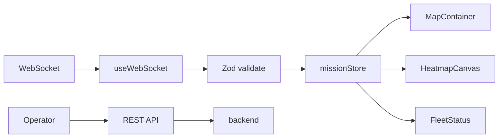

# RescuEdge Frontend

React command center for live SAR mission visualization: Mapbox map, canvas-rendered probability heatmap, fleet telemetry, and WebSocket-driven state updates.

---

## Tech Stack

| Package | Purpose |
|---------|---------|
| **React 18** | UI framework |
| **Vite** | Build tool and dev server |
| **TypeScript** | Strict typing |
| **Mapbox GL JS** | Primary map renderer (Leaflet acceptable fallback) |
| **Zustand** | Lightweight mission state store |
| **Zod** | WebSocket message validation |
| **Native WebSocket API** | Real-time backend connection |

---

## Directory Structure

```
frontend/
├── src/
│   ├── components/
│   │   ├── map/
│   │   │   ├── MapContainer.tsx      # Mapbox init, base layers
│   │   │   ├── HeatmapCanvas.tsx     # Custom layer / canvas overlay
│   │   │   ├── AssetMarkers.tsx      # GeoJSON source for fleet
│   │   │   ├── RouteLayer.tsx        # Optimized search paths
│   │   │   └── DetectionPin.tsx      # Target lock marker
│   │   ├── panels/
│   │   │   ├── MissionControl.tsx    # Create mission, set LKP
│   │   │   ├── FleetStatus.tsx       # Asset telemetry cards
│   │   │   ├── HeatmapLegend.tsx     # Color scale legend
│   │   │   └── Timeline.tsx          # Scrubber / event log
│   │   └── ui/
│   │       ├── Button.tsx
│   │       ├── Badge.tsx
│   │       └── Modal.tsx
│   ├── hooks/
│   │   ├── useWebSocket.ts           # Connection lifecycle + reconnect
│   │   ├── useHeatmap.ts             # Grid state + canvas paint
│   │   └── useMission.ts             # Mission CRUD helpers
│   ├── stores/
│   │   └── missionStore.ts           # Zustand: mission, grid, assets
│   ├── types/
│   │   ├── ws-messages.ts            # Discriminated union by `type`
│   │   └── geo.ts                    # LatLon, BBox, GeoJSON helpers
│   ├── utils/
│   │   ├── colorScale.ts             # Probability → RGBA
│   │   └── geojson.ts                # Coordinate transforms
│   ├── App.tsx
│   ├── main.tsx
│   └── index.css
├── public/
├── index.html
├── package.json
├── vite.config.ts
├── tsconfig.json
├── .env.example
└── .eslintrc.cjs
```

---

## Setup

### 1. Install Dependencies

```bash
cd frontend
npm install
```

### 2. Configure Environment

```bash
cp .env.example .env
```

| Variable | Description | Example |
|----------|-------------|---------|
| `VITE_MAPBOX_TOKEN` | Mapbox GL access token | `pk.eyJ1...` |
| `VITE_BACKEND_URL` | REST API base URL | `http://localhost:8000` |
| `VITE_BACKEND_WS_URL` | WebSocket base URL | `ws://localhost:8000/ws/mission` |

### 3. Run Development Server

```bash
npm run dev
```

App runs at `http://localhost:5173`.

### 4. Build and Lint

```bash
npm run build        # Production bundle → dist/
npm run lint         # ESLint
npm run typecheck    # tsc --noEmit
```

---

## UI Layout

```
┌─────────────────────────────────────────────────────────────┐
│  Header: Mission name, status badge, elapsed time           │
├──────────────┬──────────────────────────────┬─────────────────┤
│              │                              │                 │
│  Mission     │                              │  Fleet Status   │
│  Control     │         MAP + HEATMAP        │  (telemetry)    │
│  Panel       │         (full viewport)      │                 │
│              │                              │  Asset cards    │
│  - LKP pin   │                              │  Battery, speed │
│  - Create    │                              │  Altitude       │
│  - Assign    │                              │                 │
│              │                              │                 │
├──────────────┴──────────────────────────────┴─────────────────┤
│  Timeline / Event Log + Heatmap Legend                       │
└─────────────────────────────────────────────────────────────┘
```

- **Left panel** — Mission setup, asset assignment, optimize routes button
- **Center** — Mapbox map with canvas heatmap overlay, route lines, asset markers
- **Right panel** — Live telemetry per asset (pose, battery, last scan result)
- **Bottom** — Event timeline (negative searches, detections) and color legend

---

## Component Responsibilities

| Component | Responsibility |
|-----------|----------------|
| `MapContainer` | Initialize Mapbox, handle resize, provide map ref via context |
| `HeatmapCanvas` | Render probability grid on custom Mapbox layer or canvas overlay |
| `AssetMarkers` | Single GeoJSON source; update via `setData` on pose events |
| `RouteLayer` | Display optimized paths from `route_update` messages |
| `DetectionPin` | Animated pin on `detection_event` |
| `MissionControl` | Form to POST `/missions`, click-to-set LKP |
| `FleetStatus` | Cards bound to `missionStore.assets` |
| `Timeline` | Append-only event log from WS messages |

---

## WebSocket Message Types

Frontend subscribes to `ws://<backend>/ws/mission/{mission_id}`.

| Type | Handler | UI Effect |
|------|---------|-----------|
| `heatmap_full` | `useHeatmap.setGrid` | Initial grid on connect |
| `heatmap_delta` | `useHeatmap.applyDelta` | Update changed cells, repaint canvas |
| `route_update` | `missionStore.setRoute` | Draw LineString on map |
| `asset_pose` | `missionStore.updateAsset` | Move marker, update fleet card |
| `detection_event` | `missionStore.setDetection` | Pin target, update mission status |

Message schemas are defined in `src/types/ws-messages.ts`. Validate with Zod before dispatching to store.

---

## Data Flow



**Critical rule:** Frontend never recomputes particle physics or negative search. All probability values come from the backend.

---

## Map Integration Notes

### Heatmap Grid Alignment

Backend sends grid metadata:

```json
{
  "origin": { "lat": 37.7749, "lon": -122.4194 },
  "resolution_m": 50,
  "rows": 256,
  "cols": 256,
  "crs_epsg": 32610
}
```

Frontend maps grid cell `(row, col)` to geographic bounds using origin and resolution. The canvas overlay must sync with map pan/zoom — use Mapbox `CustomLayerInterface` or reposition canvas on `move` / `zoom` events.

### Asset Markers

Use a single GeoJSON `FeatureCollection` source. On each `asset_pose`:

```typescript
map.getSource('assets').setData(updatedFeatureCollection);
```

Do not create individual Marker DOM elements per asset.

---

## Development Guidelines

- Read [AGENT.md](AGENT.md) before implementing heatmap rendering or WebSocket hooks.
- Functional components with React Hooks only — no class components.
- Keep map ref in context; avoid prop drilling through more than two levels.
- Throttle heatmap repaints to 10 fps maximum during high-frequency delta bursts.

---

## Related Documentation

- [../README.md](../README.md) — System overview and quick start
- [../AGENT.md](../AGENT.md) — Global conventions
- [AGENT.md](AGENT.md) — Canvas heatmap rules, WebSocket patterns, Hooks-only policy
- [../backend/AGENT.md](../backend/AGENT.md) — Heatmap delta format
